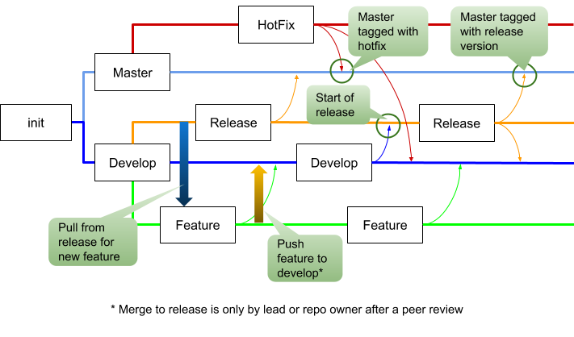

# Novice Developer's Guide for Contributing to Github and Gitlab Projects

#### 1. Clone _develop_ branch to local system

> syntax: git clone [url] -b [branch-name] --single-branch

```sh
$ git clone git@github.com:SanjeevKumarPandey/novice_developer-s_guide_for_contibuting_to_git_repos.git -b develop --single-branch
```
#### 2. For a new task or feature, create a new branch

> syntax: git checkout -b [mytask_myname] 
> _PS: Order of task and name is not important, you only need to pick a branch name that clearly shows who worked on what feature or bug_
e.g. 
```sh
$ git checkout -b adding_new_carousel_sanjeev
```
- Note that using `-b` with `checkout` creates a new branch and switches to it, while simply using `checkout` switches to a branch if it exists

#### 3. After task is done/ feature is created, and you are ready to commit, commit your branch

> syntax: `git add [filename]` or use `git add .` for commiting all changes to all files

```sh
$ git add .

$ git commit -m "add info about changes here"

$ git push -u origin mytask_myname

# note that mytask_myname is the name of the new branch you are working in
```
#### 4. Create a Pull Request
- Go to repository on github.com
- Click on 'Pull Requests' > 'New pull request'
- Use `develop` as base branch and click on 'Create pull reequest'

> Do not merge the branch yourself unless explicitly asked. Always wait for a peer/ lead review 

#### 5. Switch to _develop_ branch and pull latest changes for it

```sh
$ git checkout develop

$ git pull origin develop
```

Now you are even with the develop branch (if you weren't already)
Note: Do this **only** after you have commited your existing changes, if any

#### 6. For a new task or feature, repeat steps 2-5


## Here is a visual of how the process looks like
